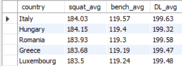

# Check your powerlifing performance
Disclaimer: 
Los datos han sido obtenidos de esta fuente: 
https://www.kaggle.com/datasets/konstantinmakarenko/debloated-powerlifting-dataset?resource=download
Para diversión del autor se ha añadido la siguiente información al DF:

1. Fechas a cada set de levantamientos (fecha aleatoria entre 01/01/2020 y 31/21/2023) 

2. Se ha asignado de manera aleatoria una ciudad (entre las 8 ciudades más importantes de cada país Europeo) a cada uno de los levantamientos

3. Se ha asignado una marca (brand) a cada uno de los equipamientos usados en los levantamientos (aleatoria entre las 20 marcas más reconocidas de powerlifting) y un rating general (aleatorio entre 3.5 y 5) Queriendo imitar la media de la puntuación de usuarios web. 

**Contexto:**\
La competición se celebra anualmente:\
2020 - 2021 - 2022 - 2023

Con tres categorías principales:\
M(male) - F(Female) - Mx(Neutral)

Cada una de estas categorías tiene restricciones por edad: \
Sub-Junior: 14 - 18 años\
Junior: 19 - 23 años\
Open: 24 - 39 años\
Master 1: 40 - 49 años\
Master 2: 50 - 59 años\
Master 3: 60 - 69 años\
Master 4: +70 años

El usuario es libre de usar el equipo que quiera dentro de los limites establecidos: \
Multi-ply: mono de powerlifting con varias capas de resistencia\
Single-ply: mono de powerlifting con una sola capa de resitencia\
Wraps: muñequeras\
Raw: sin equipamiento

Se evalúa el rendimiento de cada usuario en los tres levantamientos principales (Squat - Bench - Deadlift), cuenta la mejor marca realizada en 3 intentos para cada uno de los tres levantamientos y el máximo de KG levantados entre las tres modalidades. Además, se tendrá también en cuenta el peso relativo, definido como el peso levantado entre el peso del usuario. 

# Explorando con SQL

Primero de todo, se crea una columna con la categorización de las edades en las diferentes categorías mencionadas arriba: 
```sql
alter table powerlifting
add Categoria_edad Varchar(100);

update powerlifting 
set Categoria_edad = case 
when floor(age) >= 14 and floor(age) <= 18 then 'Sub-junior'
    when floor(age) >= 19 and floor(age) <= 23 then 'Junior'
    when floor(age) >= 24 and floor(age) <= 39 then 'Open'
    when floor(age) >= 40 and floor(age) <= 49 then 'Master_1'
    when floor(age) >= 50 and floor(age) <= 59 then 'Master_2'
    when floor(age) >= 60 and floor(age) <= 69 then 'Master_3'
    when floor(age) >= 70 then 'Master_4'
    else 'Under-age'
    end
    where id>=0;
```
(Se redondea la variable age para abajo porque el dato está en formato float y tiene algunas edades como .5.)


Miramos el número de participantes que tiene cada categoría con la varible sexo:
```sql
select 
	sex, 
	categoria_edad, 
	count(categoria_edad) as participantes 
from powerlifting
group by sex, Categoria_edad
order by sex, count(categoria_edad) desc;
```
return:\


Ordenamos por sexo y vemos que en las categorías que más participantes tenemos son las de Open y junior. También vemos que el sexo Mx tiene muy poca representación en la base de datos (https://www.usapowerlifting.com/mx-faq/)

Como se ha inventado la fecha de cada uno de los registros, vamos a comprobar cómo ha quedado la distribución anual de estos: \
La fecha está en formato 'mdY' y al transformarlo en número los meses inferiores a 10 han perdido el 0 de delante. Para que detecte bien el formato fecha, debemos añadir un 0 delante en aquellas fechas con una longitud inferior a 8 carácteres
```sql
select year, count(id) as participants from (
SELECT DATE_FORMAT(
           STR_TO_DATE(
               IF(LENGTH(date) < 8, CONCAT('0', date), date), '%m%d%Y'), '%Y') AS Year,
           id
FROM powerlifting) sub1
group by year
order by year desc;
```
\
El número de participantes es muy similar en cada año.


Comprobamos los pesos medios levantados por cada sexo en los tres levantamientos principales\
(Lanzamos misma query cambiando el 'sex'): 

```sql
select 
	Categoria_edad 					as category_Female, 
	round(avg(best3squatKg),2) 		as squat_avg, 
	round(avg(best3benchkg),2) 		as bench_avg, 
	round(avg(best3deadliftkg),2) 	as DL_avg 
from powerlifting
where sex = 'F'
group by Categoria_edad
order by avg(age);
```


Se miran los pesos promedios de los 3 levantamientos que los 5 países que más peso levantan en general:

```sql
Select 
	c.country, 
	round(avg(best3squatKg),2)	 	as squat_avg, 
	round(avg(best3benchkg),2) 		as bench_avg, 
	round(avg(best3deadliftkg),2) 	as DL_avg 
from powerlifting p 
	left join city ci on ci.City_id = p.city_id
	left join country c on ci.country_id = c.Country_id
group by c.Country
order by avg(p.totalkg) desc
Limit 5; 
```


Comparación con los países que menos levantan en general


HACER LA DIFERENCIA ENTRE EL AVG DEL PRIMERO Y EL SEGUNDO

Se genera el ranking del TOP1 levantamiento por sexo con el país al que pertenecen:

```sql
select 
    sex,
    id,
    totalKg,
    country
    from (
		select 
			row_number() over(partition by sex order by totalKg desc) as Ranking,
            sex,
            id, 
            totalkg, 
            c.country
		from powerlifting p 
        left join city ci on p.city_id = ci.city_id
        left join country c on ci.country_id = c.country_id) sub1
where Ranking=1
order by totalkg desc;
```


Veamos el impacto que tiene el uso de equipamiento en los diferentes levantamientos:\
Hay bastante diferencia entre los pesos levantados por participantes que usan equipo y los que no.

```sql
select 
	e.equipment,
	round(avg(p.best3squatKg),2)	 	as squat_avg, 
	round(avg(p.best3benchkg),2) 		as bench_avg, 
	round(avg(p.best3deadliftkg),2) 	as DL_avg
from powerlifting p 
left join equipment e on p.equipment_id = e.equipment_id
group by e.equipment
order by avg(totalkg) desc;
```


Para ver el efecto de los accesorios, dividimos el peso total medio en los levantamientos con equipamiento entre el peso medio de los levantamientos sin equipamiento. \
Para ello agrupamos los levantemientos dependiendo del equipamiento usado en diferentes views (ej):
```sql
create view total_singleply as 
select 
	e.equipment,
    p.best3squatkg,
    p.best3benchkg,
    p.best3deadliftkg,
    p.totalkg
from powerlifting p
	left join equipment e on p.equipment_id = e.equipment_id
where equipment = 'Single-ply';
```

Para luego juntarlo en una misma consulta:
```sql
select 
	e.equipment,
	concat(
    round(((select avg(totalkg) from total_multiply)/(select avg(totalkg) from total_raw)-1)*100,2)
    ,'%') as diff_multiply_percent,
    concat(
    round(((select avg(totalkg) from total_singleply)/(select avg(totalkg) from total_raw)-1)*100,2)
    ,'%') as diff_singleply_percent,
    concat(
    round(((select avg(totalkg) from total_wraps)/(select avg(totalkg) from total_raw)-1)*100,2)
    ,'%') as diff_wraps_percent
from powerlifting p 
left join equipment e on p.equipment_id = e.equipment_id
where e.equipment='Raw'
group by e.equipment;
```


Es interesante ver como cuando los atletas usan una malla de powerlifting con multiples capas levantan hasta un 40% más que cuando no usan equipamiento. Con los otros dos equipamientos la diferencia no es tan notable.
